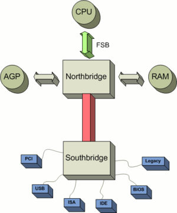

!SLIDE title-page

## CPU Caches

Jamie Allen

Chariot Day 2012

!SLIDE transition=fade
# Data Locality
.notes All algorithms are dominated by that - you have to send data somewhere to have an operation performed on it, and then you have to send it back to where it can be used.

* Spatial - reused over and over in a loop, data accessed in small regions
* Temporal - high probability it will be reused before long

!SLIDE transition=fade
# Architecture
.notes Many machines today are SMP, a multiprocessor architecture where two or more identical processors are connected to a single shared main memory and controlled by a single OS instance.  Every socket has its own infrastructure that communicates with RAM via the frontside bus and northbridge.  2011 Sandy Bridge and AMD Fusion integrated Northbridge functions into CPUs, along with processor cores, memory controller and graphics processing unit. So components are closer together today than depicted in this picture.

Image by Alexander Taubenkorb, Wikimedia Commons

!SLIDE transition=fade
# Memory Wall
.notes Gil Tene, CTO of Azul has a good presentation about this concept from a paper in 1994 on their website.  Each Intel core has 6 execution units able to perform work during a cycle (loading memory, storing memory, arithmetic, branch logic, shifting, etc), but they need to be fed data very fast to take advantage of it. Note that it didn't happen because of RAM, but the Application Memory Wall does exist in other forms, like GC pauses.

* CPUs are getting faster
* Memory isn't, and bandwidth is increasing at a much slower rate
* It was predicted that applications would become memory-bound by now
* Didn't happen

!SLIDE transition=fade
# Memory Controller
.notes Memory controller were moved onto the processor die by AMD beginning with their AMD64 processors and by Intel with their Nehalem processors

* Handles communication between the CPU and RAM
* Contain the logic to read to and write from RAM
* Integrated Memory Controller

!SLIDE transition=fade
# Non-Uniform Memory Access (NUMA)

* Access time is dependent on the memory locality to a processor
* Memory local to a processor can be accessed faster than memory farther away
* The organization of processors reflect the time to access data in RAM, called the NUMA factor.

!SLIDE transition=fade
# Registers
.notes single cycle = 1/3 of a NS.

* On-core
* Can be accessed in a single cycle
* A 64-bit Intel Nehalem CPU has 128 Integer registers, 128 floating point registers

!SLIDE transition=fade

!SLIDE transition=fade

!SLIDE transition=fade
# Store Buffers

!SLIDE transition=fade
# SRAM

* Requires 6-8 pieces of circuitry per datum
* Runs at a cycle rate, not quite measurable in time

!SLIDE transition=fade
# L1

* 32K data, 32K instructions. 
* 3-4 cycles to get to that memory.

!SLIDE transition=fade
# L2

* Bigger
* ~3 times slower

!SLIDE transition=fade
# L3
.notes where concurrency takes place, data is passed between cores on a socket

* Shared between cores  
* Uses Quick Path links (QPI) for cache coherency and snooping

!SLIDE transition=fade
# MESI Cache Coherency Protocol

* Modified, the local processor has changed the cache line, implies only one who has it
* Exclusive, only one processor is using the cache line, not modified
* Shared, multiple processors are using the cache line, not modified
* Invalid, the cache line is invalid (unused)
* Each QPI message takes ~20NS

!SLIDE transition=fade
# DRAM
.notes Reading contiguous memory is faster than random access due to how you read - you get one line buffer at a time from each of the memory banks, 33% slower.

* Very dense, only 2 pieces of circuitry per datum
* Refresh is just another read operation where the result is discarded & blocks access
* DRAM "leaks" its charge, but not sooner than 64 milliseconds
* Every read causes depletes the charge, requires a subsequent recharge
* Memory Controllers can "refresh" DRAM by sending a charge through the entire device
* Takes NS to retrieve from here

!SLIDE transition=fade
# DDR3 SDRAM

* Double Data Rate, Synchronous Dynamic
* Has a high-bandwidth three-channel interface
* Also reduces power consumption over DDR2 by 30%
* Data is transferred on the rising and falling edges of a 400-1066 MHz I/O clock of the system

!SLIDE transition=fade
# DDR4 is coming

* Higher range of clock frequencies and data transfer rates[
* Significantly lower voltage

!SLIDE transition=fade
# Striding & Pre-fetching
.notes cache lines are most commonly 64 contiguous bytes, can be 32-256.  Doesn't have to be contiguous in an array, you can be jumping in 2K chunks without a performance hit.  As long as it's predictable, it will fetch the memory before you need it and have it staged.

* Predictable memory access is really important
* Hardware prefetcher on the core looks for patterns of memory access

!SLIDE transition=fade
# Cache Misses
.notes The pre-fetcher will bring data into L1 for you.  The simpler your code, the better it can do this.  If your code is complex, it will do it wrong, costing a cache miss and forcing it to lose the value of pre-fetching and having to go out to an outer layer to get that instruction again.

* Cost hunderds of cycles
* Keep your code simple

!SLIDE transition=fade
# Shared Cache Lines
.notes Be careful about what's on them, because if a line holds multiple variables and the state of one changes, coherency must be maintained.  Kills performance for parallel threads on an SMP machine

* Look out for false sharing
* Padding can be used to ensure unshared line
* @Contended annotation coming?

!SLIDE transition=fade
# Programming Optimizations
.notes Short lived data is not. Variables scoped within a method are stack allocated and very fast.  Think about the affect of contending locking.  You've got a warmed cache with all of the data you need, and because of contention (arbitrated at the kernel level), the thread will be put to sleep and your cached data is sitting until you can gain the lock from the arbitrator.  Due to LRU, it could be evicted.  The kernel is general purpose, may decide to do some housekeeping like defragging some memory, futher polluting your cache.  When your thread finally does gain the lock, it may end up running on an entirely different core and will have to rewarm its cache.  Everything you do will be a cache miss until its warm again.  CAS is better, an optimistic locking strategy.  Most version control systems use this.  Check the value before you replace it with a new value.  If it's different, re-read and try again.  Happens in user space, not at the kernel, all on thread.  Algos get a lot harder, though - state machines with many more steps and complexity.  And there is still a non-negligible cost

* Stack allocated data is cheap
* Pointer interaction - you have to retrieve data being pointed to, even in registers
* Avoid locking

!SLIDE transition=fade
# What about Functional Programming?
.notes Eventually, caches have to evict.  Cache misses cost hundreds of cycles.

* Have to allocate more and more space for your data structures.  
* When you cycle back around, you get cache misses

!SLIDE transition=fade
# Data Structures
.notes  If n is not very large, an array will beat it for performance.  LL and trees have pointer chasing which are bad for striding across 2K cache pre-fetching.  Java's hashmap uses chained buckets, where each hash's bucket is a linked list.  Clojure/Scala vectors are good, because they have groupings of contiguous memory in use, but do not require all data to be contiguous like Java's ArrayList.  Fastutil is additive, no removal, but that's how I'm currently using Riak, too.

* BAD: Linked list structures and tree structures
* BAD: Java's HashMap uses chained buckets!
* BAD: Standard Java collections generate lots of garbage
* GOOD: Array-based and contiguous in memory is much faster
* GOOD: Write your own that are lock-free and contiguous
* Fastutil library

!SLIDE transition=fade
# Application Memory Wall & GC
.notes We can have as much RAM/heap space as we want now.  And requirements for RAM grow at about 100x per decade.  But are we now bound by GC?  You can get 100GB of heap, but how long do you pause for marking/remarking phases and compaction?  Even on a 2-4 GB heap, you're going to get multi-second pauses - when and how often?  IBM Metronome collector is very fast (microseconds) if you don't produce more than a certain amount of garbage.  Azul around one millisecond for phenomenal amounts of garbage.

* Tremendous amounts of RAM at low cost
* But is GC the real cause?
* Use pauseless GC

!SLIDE transition=fade
# Using GPUs
.notes Graphics card processing (OpenCL) is great for specific kinds of operations, like floating point arithmetic. But they don't perform well for all operations, and you have to get the data to them.  

* Locality matters!
* Need to be able to export a task with data that does not need to update

!SLIDE transition=fade
# Manycore 

!SLIDE transition=fade
# Memristor
. notes from HP, due to come out this year or next, may change memory fundamentally.  If the data and the function are together, you get the highest throughput and lowest latency possible.

* Non-volatile RAM
* 200-300 MB on chip
* Sub-nanosecond writes

http://en.wikipedia.org/wiki/Memristor

!SLIDE transition=fade
# !SLIDE transition=fade
# Credits

* Sources
	* What Every Programmer Should Know About Memory
		* Ulrich Drepper of RedHat, 2007
	* Java Performance
	* Wikipedia/Wikimedia Commons
	* Martin Thompson's Mechanical Sympathy blog and Disruptor presentations
	* Gil Tene, CTO of Azul Systems (http://www.azulsystems.com/presentations/application-memory-wall)
